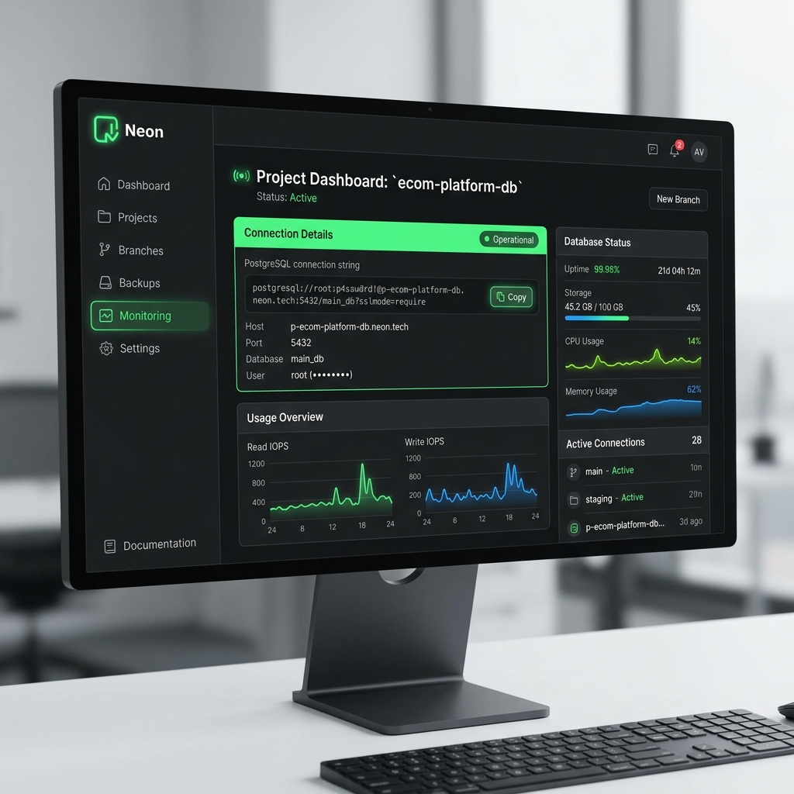

# 5️⃣ Acesso a Dados com Neon PostgreSQL

Em um sistema de verdade, os dados não ficam na memória (se não, apagam quando você fecha o programa). Eles precisam ser salvos em um Banco de Dados. 

Para tornar o nosso supermercado moderno e acessível, usaremos o **Neon PostgreSQL**, um banco de dados poderoso, serverless (na nuvem) e gratuito para estudantes.

## 1. Criando a conta no Neon

1. Acesse: [neon.tech](https://neon.tech/)
2. Crie uma conta gratuita (você pode usar sua conta do GitHub ou Google).
3. Após o login, crie um novo projeto chamado `SupermercadoDB`.
4. Escolha a região mais próxima (ex: US East).
5. Clique em **Create Project**.


*(Dashboard moderno do Neon DB mostrando a string de conexão)*

## 2. A String de Conexão

No dashboard do Neon, você verá uma **Connection String** (String de Conexão). Ela se parece com isso:

```text
Host=ep-cool-butterfly-12345.us-east-2.aws.neon.tech;Database=neondb;Username=diogo;Password=SUA_SENHA;SSL Mode=Require;Trust Server Certificate=true;
```

Essa string é como se fosse o "endereço, usuário e senha" para que o nosso sistema C# consiga achar o banco na internet. **Guarde-a com cuidado!**

## 3. Instalando o Npgsql no Visual Studio

Para o C# conseguir "falar" com o PostgreSQL, ele precisa de um tradutor. Esse tradutor se chama **Npgsql**.

No Visual Studio:
1. Vá em `Ferramentas (Tools)` -> `Gerenciador de Pacotes do NuGet` -> `Gerenciar Pacotes do NuGet para a Solução...`.
2. Clique na aba **Procurar (Browse)**.
3. Digite `Npgsql`.
4. Selecione o pacote oficial e clique em **Instalar**.

## 4. Criando o Repositório de Usuários

Na pasta `Models`, crie a classe `Usuario.cs`:

```csharp
namespace SupermercadoApp.Models
{
    public class Usuario
    {
        public int Id { get; set; }
        public string Username { get; set; }
        public string Senha { get; set; } // Em um sistema real, aqui iria um Hash!
        public string Cargo { get; set; }
    }
}
```

Na pasta `Repositories`, vamos criar nossa classe `UsuarioRepository.cs`:

```csharp
using Npgsql;
using SupermercadoApp.Models;

namespace SupermercadoApp.Repositories
{
    public class UsuarioRepository
    {
        // Cole a string de conexão do Neon DB aqui!
        private string connectionString = "Host=...;Database=...;Username=...;Password=...;";

        public Usuario Autenticar(string username, string senha)
        {
            using (var connection = new NpgsqlConnection(connectionString))
            {
                connection.Open(); // Abre a porta para a nuvem

                string sql = "SELECT * FROM Usuarios WHERE Username = @username AND Senha = @senha";
                
                using (var command = new NpgsqlCommand(sql, connection))
                {
                    // Parâmetros protegem contra SQL Injection (ataque hacker)
                    command.Parameters.AddWithValue("username", username);
                    command.Parameters.AddWithValue("senha", senha);

                    using (var reader = command.ExecuteReader())
                    {
                        if (reader.Read()) // Se encontrou alguém...
                        {
                            return new Usuario
                            {
                                Id = reader.GetInt32(0),
                                Username = reader.GetString(1),
                                Cargo = reader.GetString(3)
                            };
                        }
                    }
                }
            }
            return null; // Usuário ou senha incorretos
        }
    }
}
```

> **Atenção:** Para que o código acima funcione, você precisa criar a tabela `Usuarios` lá no Neon. Você pode fazer isso no SQL Editor do Neon com o comando:
> ```sql
> CREATE TABLE Usuarios (Id SERIAL PRIMARY KEY, Username VARCHAR(50), Senha VARCHAR(50), Cargo VARCHAR(50));
> INSERT INTO Usuarios (Username, Senha, Cargo) VALUES ('admin', '123456', 'Gerente');
> ```

Com o banco de dados e o repositório prontos, chegou a hora mais divertida: criar a interface visual!

➡️ **[Ir para o Módulo 6: Criando a Tela de Login](./06-Tela-de-Login.md)**
