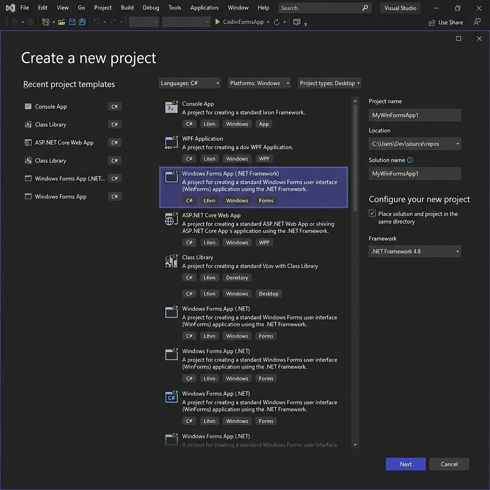
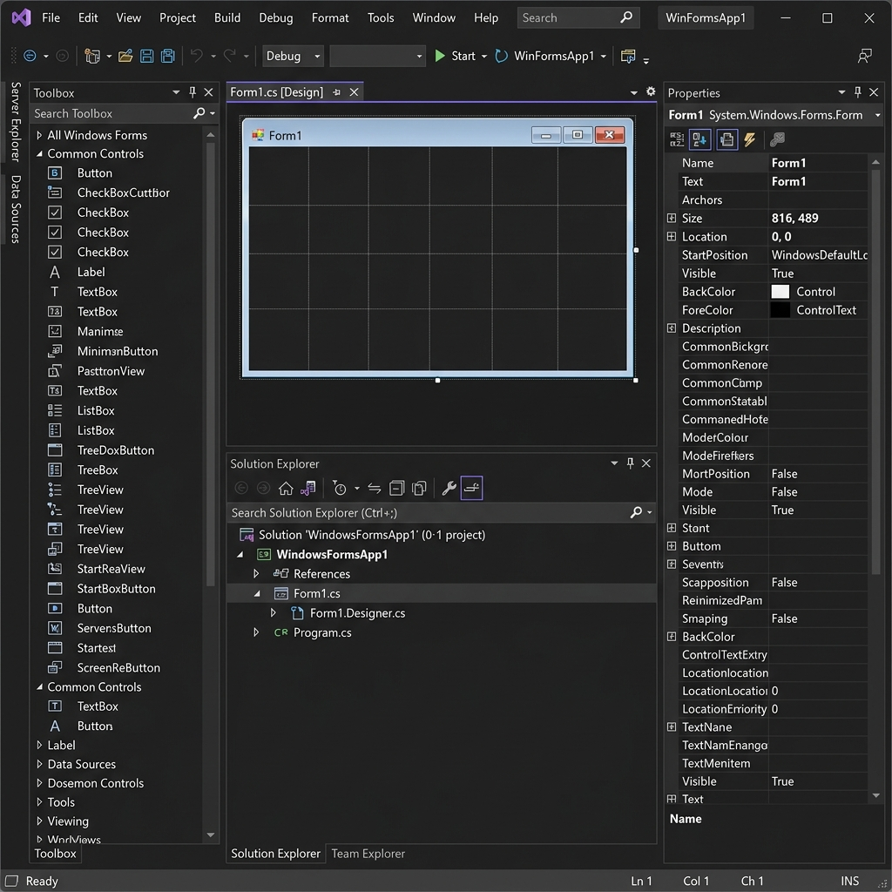

# 4️⃣ Configuração do Ambiente (Visual Studio 2022)

Para criarmos nosso Sistema de Supermercado em C#, utilizaremos a principal ferramenta do mercado para ecossistema .NET: o **Visual Studio 2022**.

## 1. Baixando e Instalando o Visual Studio 2022

1. Acesse o site oficial: [visualstudio.microsoft.com](https://visualstudio.microsoft.com/)
2. Baixe a versão **Community** (Ela é gratuita e completa para estudantes e desenvolvedores individuais).
3. Durante a instalação, o instalador perguntará quais "cargas de trabalho" (Workloads) você deseja instalar.
4. **IMPORTANTE:** Marque a opção **Desenvolvimento para Desktop com .NET** (Isso incluirá o C# e o Windows Forms).

## 2. Criando o Projeto

Com o Visual Studio instalado, siga estes passos para criar o esqueleto do nosso sistema:

1. Abra o Visual Studio 2022.
2. Clique em **Criar um novo projeto** (Create a new project).
3. Na barra de pesquisa, digite `Windows Forms` ou procure na lista.
4. Selecione o template **Aplicativo do Windows Forms (Windows Forms App - .NET)**. Cuidado para não escolher a versão antiga "(.NET Framework)". Nós queremos a versão mais nova.

*(Exemplo da tela de criação de projeto no Visual Studio 2022)*

5. Dê um nome ao projeto, como `SupermercadoApp`.
6. Escolha o **.NET 8.0 (Suporte de Longo Prazo)**.
7. Clique em **Criar**.

## 3. Conhecendo o Windows Forms Designer

Quando o projeto for criado, você verá uma tela em branco chamada `Form1`. Esta é a sua tela!

*(Visual Studio 2022: Caixa de Ferramentas à esquerda e Propriedades à direita)*

- **Caixa de Ferramentas (Toolbox):** Fica geralmente na esquerda. É aqui que você encontra os botões (Button), caixas de texto (TextBox) e rótulos (Label) para arrastar para a sua tela.
- **Janela de Propriedades (Properties):** Fica geralmente na direita. Quando você clica em um botão, é aqui que você muda a cor dele, o texto, a fonte e o nome interno (`Name`).
- **Gerenciador de Soluções (Solution Explorer):** Onde ficam os arquivos do seu projeto. É por aqui que criaremos as nossas pastas (`Models`, `Repositories`, `Views`).

## 4. Organizando a Arquitetura

Lembra do Módulo 3? Vamos organizar nosso projeto agora. No **Gerenciador de Soluções**, clique com o botão direito no nome do seu projeto (`SupermercadoApp`) -> `Adicionar` -> `Nova Pasta`.

Crie as seguintes pastas:
- `Models` (Onde ficarão nossas classes)
- `Repositories` (Onde ficarão as conexões com o banco de dados)
- `Views` (Onde colocaremos nossas telas/Forms)

Agora que o ambiente está pronto, vamos preparar o nosso Banco de Dados na Nuvem!

➡️ **[Ir para o Módulo 6: Criando Interface de Login](./06-Criando-Interface-Login.md)**
