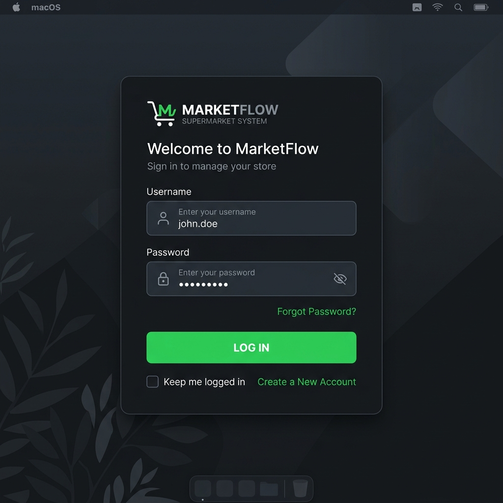

# 5️⃣ Criando a Interface Visual da Tela de Login

A primeira impressão do nosso sistema de supermercado será a tela de login. Queremos algo moderno, com cara de aplicação profissional. Nesta etapa, vamos focar **apenas no design visual** (a cara do programa), sem programar a conexão com o banco de dados ainda.

*(Ideia de design para a nossa tela de Login)*

## 1. Preparando o Formulário (Form)

No Visual Studio, o "Form1" que foi criado por padrão é a janela do seu programa. Vamos personalizá-lo:

1. No **Gerenciador de Soluções (Solution Explorer)** (geralmente do lado direito), crie uma pasta chamada `Views`.
2. Arraste o arquivo `Form1.cs` para dentro da pasta `Views`.
3. Clique com o botão direito no `Form1.cs`, selecione **Renomear** e mude para `FormLogin.cs`. Se o Visual Studio perguntar se você quer renomear todas as referências, clique em **Sim**.
4. Dê um duplo clique em `FormLogin.cs` para abrir o modo **Designer** (onde você pode "desenhar" a tela).

Na janela de **Propriedades (Properties)** (no canto inferior direito), configure as seguintes propriedades do seu Formulário:
- `Text`: Supermercado - Login *(Este é o título da janela)*
- `BackColor`: Escolha uma cor escura elegante (ex: clique na aba 'Custom' e digite `45, 45, 48`) ou deixe branco puro.
- `StartPosition`: Mude para `CenterScreen` *(Para que o programa abra bem no meio do monitor)*.
- `FormBorderStyle`: Mude para `FixedSingle` *(Para o usuário não conseguir redimensionar ou esticar a janela)*.

## 2. Adicionando os Componentes (Caixa de Ferramentas)

A **Caixa de Ferramentas (Toolbox)**, que fica à esquerda, contém os "peças de lego" do nosso sistema. Arraste os seguintes itens para a tela:

### A) Título da Tela
1. Arraste um **Label** (Rótulo).
2. Na janela de Propriedades, mude o `Text` para "MarketFlow - Supermercado".
3. Mude a propriedade `Font` para um tamanho maior, como 16, e coloque em Negrito (Bold).
4. Se o fundo da sua tela for escuro, mude o `ForeColor` para Branco (`White`).

### B) Campo de Usuário
1. Arraste um **Label** e mude o `Text` para "Usuário:".
2. Arraste um **TextBox** (Caixa de Texto) e posicione abaixo do label.
3. **MUITO IMPORTANTE:** Mude a propriedade `Name` do TextBox para `txtUsuario`. (É através desse nome que o C# vai saber qual caixa ler depois).

### C) Campo de Senha
1. Arraste outro **Label** e mude o `Text` para "Senha:".
2. Arraste outro **TextBox**.
3. Mude a propriedade `Name` para `txtSenha`.
4. Mude a propriedade `PasswordChar` para `*`. Isso faz com que a senha fique escondida por asteriscos quando o usuário digitar.

### D) Botão de Entrar
1. Arraste um **Button** (Botão).
2. Mude a propriedade `Name` para `btnLogin`.
3. Mude a propriedade `Text` para "ENTRAR".
4. Personalize! Mude o `BackColor` para um verde ou azul vibrante e o `ForeColor` (Cor da letra) para Branco.

Nossa interface visual está pronta! Se você clicar no botão "Iniciar" (Start) no topo do Visual Studio, o programa vai abrir e você verá a sua tela. Porém, o botão "ENTRAR" ainda não faz nada. 

Para que ele funcione, precisamos de um banco de dados com os usuários cadastrados. É o que faremos no próximo módulo!

➡️ **[Ir para o Módulo 6: Criando o Banco de Dados Neon](./06-Criando-Banco-Dados-Neon.md)**
